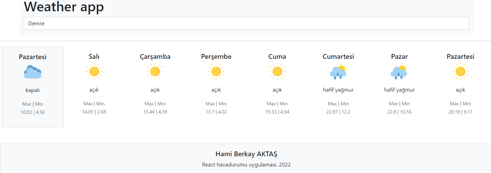

# React App

React,  context api ve Fake api ile hava durumu verilerini çeken react uygulaması.

harici modüller 

- "axios": "^0.27.2",
- "formik": "^2.2.9",

* fake apiyi : calıştırmak için

      cd "Fake Api"
      npm run start:server

* react uygulaması için

      npm start

* uygulama görüntüsü

